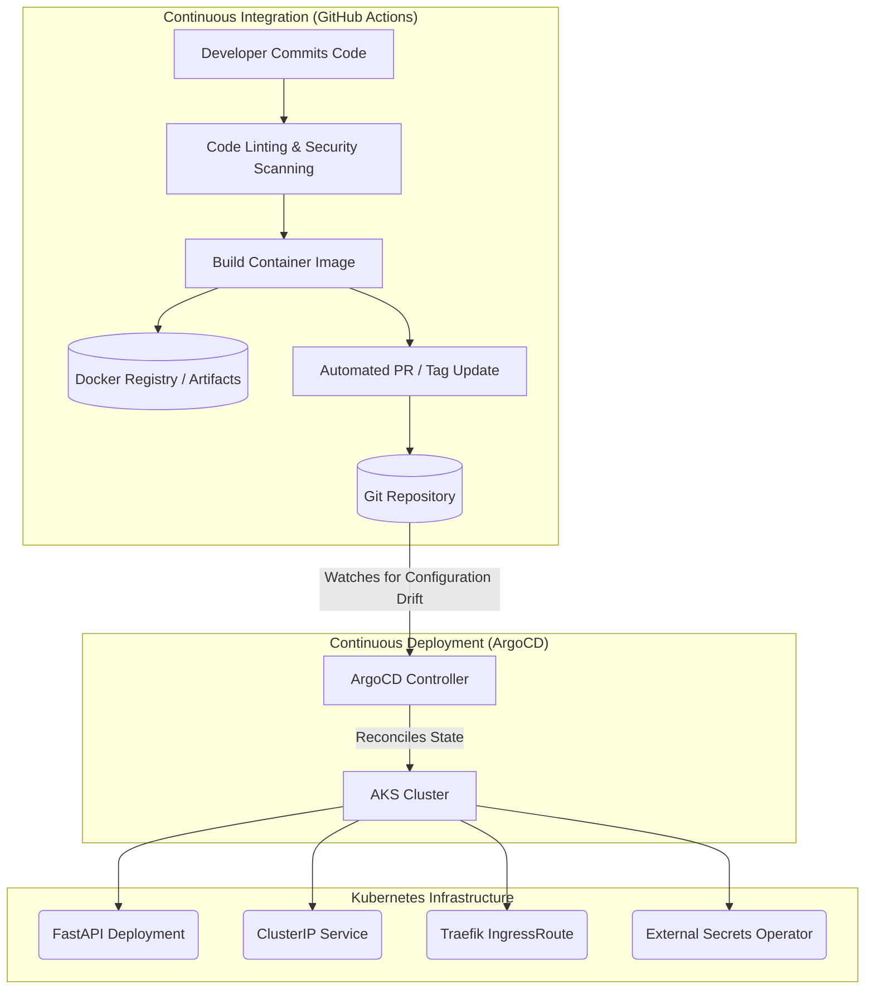
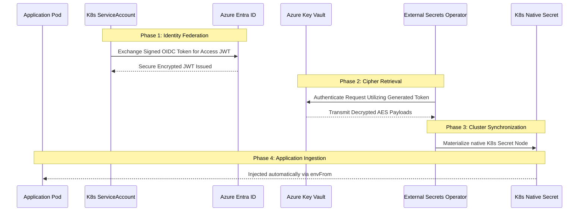

# 🚀 Deployment Architecture & GitOps Methodology

This document serves as an academic deep-dive into the architectural design, lifecycle, and implementation methodology of the **PureSecure CWE Explorer** deployment process. 

The deployment leverages a modern, declarative GitOps approach powered by Kubernetes (AKS), ArgoCD, Helm, External Secrets Operator (ESO), and Azure Workload Identity.

## 1. Architectural Overview

The deployment architecture is designed around the principle of **Immutable Infrastructure** and **Declarative State Declarations**. 

Instead of imperatively pushing changes to the server (e.g., executing manual `kubectl apply` shell scripts), the infrastructure's desired target state is defined purely in code within this Git repository. A synchronization agent (ArgoCD) running autonomously inside the cluster continually ensures that the live cluster state exactly reflects the declared Git state.



## 2. CI/CD Lifecycle Deep Dive

### Phase 1: Continuous Integration (CI)
When a developer commits codebase changes to the main integration branch, the Continuous Integration pipeline is triggered.

1. **Static Analysis & Testing**: Validates code robustness, executes unit topologies, and identifies vulnerabilities via SCA tools early in the pipeline.
2. **Containerization**: The `Dockerfile` compiles the dependency matrix using a deterministic multi-stage build structure. The architecture specifically binds to a minimized attack surface (Debian Slim OS) and enforces execution under a non-root `appuser`.
3. **Artifact Publishing**: The resulting immutable image is hashed, cryptographically tagged (e.g., matching a Git SHA or Semantic Versioning node), and deposited into DockerHub.
4. **Declarative Update**: The CI machine issues an imperative patch sequence to the `helm/puresecure/values.yaml` file, overwriting the structural image tag property, and commits the mutation back to the central repository.

### Phase 2: GitOps Synchronization (CD)
ArgoCD's internal polling controller triggers asynchronously.

1. **Drift Detection**: ArgoCD derives the structural delta by mathematically comparing the generic live Kubernetes manifest inside the cluster with the locally-rendered Helm templates originating from Git.
2. **Reconciliation Loop**: Ascertaining that the `values.yaml` image tag has incremented, ArgoCD executes a synchronization process.
3. **Zero-Downtime Rollout Execution**: The native Kubernetes controller accepts the modification and delegates a rigorous rolling update. It spins up a new ReplicaSet containing the updated container logic. Only once the new Pod's Liveness/Readiness probes (`/api/health`) resolve HTTP 200 does the controller sequentially drain and terminate the legacy Pods, ensuring zero network disruption.

---

## 3. Security Architecture & Advanced Secrets Management

Persisting static secrets natively inside Git repositories or generic Kubernetes `Secret` entities represents a catastrophic surface vulnerability due to standard base64 encoding vectors. Ergo, PureSecure implements an **Azure Key Vault** matrix physically separated from the cluster data plane, interfaced via the **External Secrets Operator (ESO)** and authenticated cryptographically using **Azure Workload Identity**.



### Resource Topology & Security Implications

1. **User-Assigned Managed Identity**: An abstract Azure identity primitive possessing strict RBAC constraints (`Key Vault Secrets User`) mapping solely to the production Key Vault.
2. **Kubernetes ServiceAccount (`puresecure-sa`)**: Structurally annotated with the `azure.workload.identity/client-id`. This forces the Kubernetes OIDC configuration engine to mint a universally trusted federation token without requiring any permanent static credentials bridging AWS/GCP to Azure boundaries.
3. **SecretStore (`secret-store.yaml`)**: An ESO Custom Resource Definition (CRD) that logically establishes *how* authentication is processed. 
   - *Academic Outcome*: It enforces the `provider: azurekv` standard and natively links the cluster's `tenantId` mapping to authorize the Workload Identity transaction graph dynamically.
4. **ExternalSecret (`external-secret.yaml`)**: An ESO CRD governing exactly *what* secrets are required by pointing explicitly to specific internal Vault nodes (e.g., querying `service-api-key`). When verified, the ESO orchestrator physically materializes a K8s generic `Secret` named `app-secrets`.
5. **Deployment Environment Injection**: The FastAPI `Deployment` natively ingests `app-secrets` utilizing Kubernetes construct `envFrom`. This safely mounts the secrets sequentially as OS-level environment variables strictly bound directly into the active container memory.

---

## 4. Hierarchical Kubernetes Resource Schema

When the ArgoCD daemon successfully negotiates a Helm deployment, the following layered resource architecture is generated dynamically within the restricted `puresecure` namespace:

| Resource Type | Internal Component Name | Academic Infrastructure Function |
| :--- | :--- | :--- |
| **Deployment** | `puresecure` | Owns the declarative state of the subordinate ReplicaSets. Dictates automatic horizontal healing, the rolling update paradigm, liveness/readiness TCP probing, and structural hardware quotas (CPU limits constraints). |
| **Service** | `puresecure` | Generates a permanent internal IP address and standard ClusterDNS record. It establishes a necessary abstraction bridge, round-robin load-balancing generic transverse traffic uniformly to the ephemeral physical Pods hidden underneath it. |
| **IngressRoute** | `puresecure-ingress` | A Traefik-dictated CRD enforcing Layer 7 TLS transport termination proxying. Utilizing core SNI inspection, it evaluates incoming domain requests (`puresecure.reondev.top`) and subsequently routes HTTP/2 traffic into the internal Service subnet. |
| **ServiceAccount** | `puresecure-sa` | An OIDC-federated gating mechanism executed by the AKS controller itself to guarantee cryptographically undeniable credentials inside the pod context footprint. |
| **SecretStore** | `azure-keyvault` | Binds the identity schema boundary configurations connecting the local cluster to the remote tenant cryptographic backend interface. |
| **ExternalSecret** | `app-secrets` | Operates as an automated polling lease forcing immediate physical synchronization between external variables mapping into standard Kubernetes generic configuration secrets. |

---

## 5. Bootstrapping Commands & Operational Diagnostics

Before an automated GitOps deployment can initiate natively, a structural foundation must be mechanically instantiated by human operators across standard CI environments:

### Step 1: Base API Initialization and CRD Extensibility
The bare Kubernetes orchestrator must initially be trained to correctly interpret the non-standard metadata dictionaries representing Traefik logic and External Secrets mechanisms.

```bash
# Add ESO registry and initiate cluster injection with CRD validation
helm repo add external-secrets https://charts.external-secrets.io
helm install external-secrets external-secrets/external-secrets \
    -n external-secrets --create-namespace \
    --set installCRDs=true
```
*Theoretical Rationale:* Kubernetes inherently acts as a malleable, extensible HTTP REST API. By enabling the flag `installCRDs=true`, we programmatically mutate the actual foundational database schema structures internally within Kubernetes. Without doing this exact pre-requisite, ArgoCD's API requests containing `kind: SecretStore` schemas would fail entirely with catastrophic parsing errors.

### Step 2: Instantiating the Defensive Boundary Zone
To aggressively enforce a structural isolation barrier against malformed configurations or rogue API interactions, an app tenancy mapping is defined.

```bash
# Synchronize internal RBAC logical perimeter maps into memory
kubectl apply -f argocd/project.yaml
```
*Academic Necessity:* The resulting `AppProject` explicitly enumerates all legally permitted remote Git boundaries and implicitly restricts precisely which Kubernetes structural elements (such as explicit Namespaces and external configurations) a generic deployment branch commands.

### Step 3: Triggering the GitOps Deployment
Once base configurations sit ready, the definitive infrastructure architecture truth must be introduced. 

```bash
# Register the application logic matrix to the ArgoCD engine
kubectl apply -f argocd/application.yaml
```
*Mechanical Outcome Sequence:* ArgoCD reads this schema document declaring an absolute origin `repoURL` and targeting specific local configuration sub-files nested strictly on the target layout (`path: helm/puresecure`). Armed with an intrinsic policy enforcing `automated.prune=true`, ArgoCD initiates total authoritarian system dominance spanning the `puresecure` execution zone. If a tertiary admin attempts an unauthorized imperative schema mutation (via raw `kubectl` edits natively on the cluster node), ArgoCD identifies the drift vector automatically within approximately three minutes and completely deletes the rogue component to rigorously solidify system immutability.

---

## 6. Synthesizing Local Developer Emulation (Docker Compose)

The fundamental challenge inherent within heavily abstracted execution structures (such as Cloud Kubernetes setups) is translating them locally for unhindered rapid development without compromising structural accuracy. 

```bash
# Spawns a fully segmented localized network mimicking remote infrastructure
docker compose up web --build
```

### Deep Architectural Functionality in the Local Topography
The `docker-compose.yml` natively bypasses massive infrastructural orchestration dependencies by replicating core functionality mechanics across constrained isolated binaries:

1. **Volume Substitution Emulation (Hot Reload Limits):** Rather than copying statically packaged binaries into an immutable volume stack per execution (the production standard), Docker Compose dynamically maps a Host OS Bind Mount node crossing boundaries into the Linux container namespace (`./app:/app/app:ro`). When standard Python logic changes natively inside the local VFS file tree, the `uvicorn` interpreter acknowledges kernel-level filesystem events inside its isolated container boundary, gracefully executing a non-destructive application tear-down and rebuild mapping sequence in roughly six milliseconds.
2. **Key Vault Structural Parity:** Standard local development terminals intrinsically lack access paths targeting automated Kubernetes `ServiceAccount` JWTs interacting internally against cloud Key Vault endpoints via ESO routing. To mitigate this configuration mismatch gap entirely, `docker-compose.yml` leverages standard dynamic `.env` compilation loading sequences to inject precisely named key values (`SERVICE_API_KEY`) identically mimicking how native cluster components translate `ExternalSecret` variables sequentially out toward runtime environments. 

Through these distinct mappings, deployment parameters inherently retain absolute compatibility scaling freely backward from enterprise AKS clusters directly into standard desktop operational structures.
