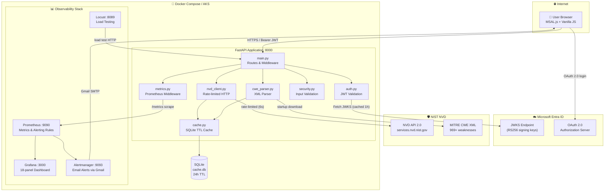
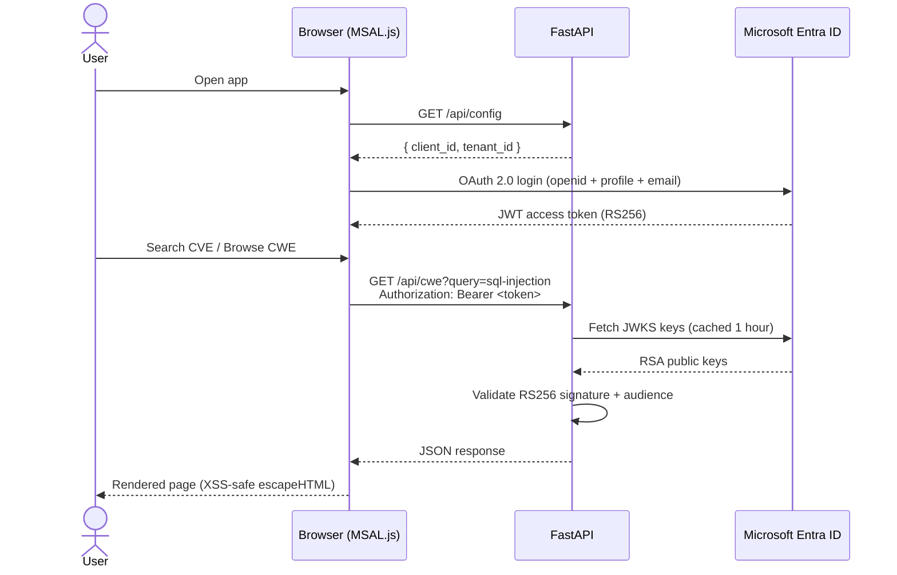
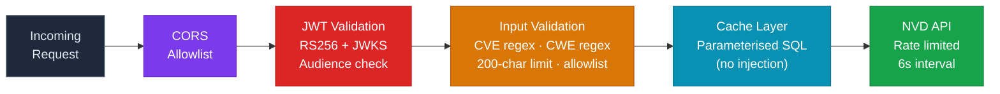
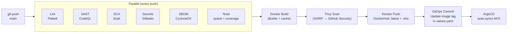

<div align="center">

# PureSecure CVE Explorer

**A production-grade security intelligence platform for browsing, searching, and analysing CVE & CWE vulnerability data — with real-time observability, GitOps deployment, and Microsoft Entra ID authentication.**

[](https://github.com/reonbritto/test-proj/actions)
[](https://python.org)
[](https://fastapi.tiangolo.com)
[](https://docs.docker.com/compose/)
[](https://azure.microsoft.com/en-us/products/kubernetes-service)
[](https://grafana.com)
[](LICENSE)

[**Live Demo**](https://reondev.top) · [**Grafana Dashboard**](https://grafana.reondev.top/d/cwe-explorer-api) · [**ArgoCD**](https://argocd.reondev.top)

</div>

---

## What is this?

PureSecure CVE Explorer queries the **NIST National Vulnerability Database (NVD) API 2.0** in real-time and provides a clean, searchable interface for security professionals to:

- Browse and search **CVEs** (Common Vulnerabilities and Exposures) with CVSS severity scores
- Explore **CWE** (Common Weakness Enumeration) definitions — 969+ weaknesses from the official MITRE XML dataset
- Visualise vulnerability trends via a **Grafana** monitoring dashboard
- Get email alerts when critical error rates or latency thresholds are breached via **Alertmanager**

The entire stack (API, monitoring, alerting, load testing) runs locally with a single `docker compose up`, and deploys to production on AKS via **ArgoCD GitOps**.

---

## Screenshots

| Dashboard | CVE Detail | Grafana |
|:---------:|:----------:|:-------:|
|  |  |  |

---

## Architecture

### System Overview



### Production Deployment (AKS + GitOps)

```mermaid
graph LR
    subgraph Dev["👨‍💻 Developer"]
        CODE["git push\nmain branch"]
    end

    subgraph CI["⚙️ GitHub Actions"]
        direction TB
        LINT["1. Lint (Flake8)"]
        SAST["2. SAST (CodeQL)"]
        SCA["3. SCA (Snyk)"]
        SECRET["4. Secrets (Gitleaks)"]
        SBOM["5. SBOM (CycloneDX)"]
        TEST["6. Tests (pytest)"]
        BUILD["7. Docker Build"]
        TRIVY["8. Trivy Scan"]
        PUSH["9. DockerHub Push"]
        GITOPS["10. GitOps Commit\n(update image tag in Helm values)"]

        LINT --> SAST --> SCA --> SECRET --> SBOM --> TEST --> BUILD --> TRIVY --> PUSH --> GITOPS
    end

    subgraph GitOps["🔄 ArgoCD (AKS)"]
        ARGO["ArgoCD\nWatches main branch"]
        HELM["Helm Chart\npuresecure/"]
    end

    subgraph K8s["☸️ Azure Kubernetes Service"]
        direction TB
        TRAEFIK["Traefik Ingress\n+ Let's Encrypt TLS"]
        APP_POD["App Pods"]
        PROM_POD["Prometheus"]
        GRAF_POD["Grafana + Alertmanager"]

        subgraph Secrets["🔐 Secret Management"]
            ESO["External Secrets Operator"]
            KV["Azure Key Vault"]
            MI["Workload Identity\n(Managed Identity)"]
        end
    end

    CODE --> CI
    GITOPS -- "commits values.yaml" --> ARGO
    ARGO --> HELM --> TRAEFIK --> APP_POD
    ESO --> KV --> MI
    APP_POD --> ESO
```



### Authentication Flow



---

## Features

| Category | Feature |
|----------|---------|
| **CVE Search** | Real-time keyword search, CWE filter, severity filter, debounced autocomplete |
| **CVE Detail** | CVSS v2 + v3 scores, severity badges, affected products (CPE), references |
| **CWE Browsing** | 969+ MITRE definitions — consequences, mitigations, detection methods, taxonomy |
| **Analytics** | Top CWEs by CVE count, composite risk scoring (frequency × severity) |
| **Authentication** | Microsoft Entra ID (Azure AD) JWT — supports Work + Personal Microsoft accounts |
| **Caching** | SQLite with 24h TTL, WAL mode for concurrent reads, startup cleanup |
| **Monitoring** | Prometheus metrics, 17 recording rules, 11 alerting rules, Grafana dashboard (18 panels) |
| **Alerting** | Alertmanager → Gmail SMTP → email for critical/warning severity alerts |
| **Load Testing** | Locust scenarios covering all endpoints with weighted traffic distribution |
| **Security** | Input validation, parameterised queries, defusedxml (XXE), non-root container, CORS |
| **CI/CD** | 10-stage GitHub Actions: lint → SAST → SCA → secrets scan → SBOM → test → build → scan → push → GitOps |
| **GitOps** | ArgoCD auto-sync from `main` branch, Helm chart, automatic TLS via Let's Encrypt |
| **Secret Management** | Azure Key Vault + External Secrets Operator + Workload Identity (zero secret sprawl) |
| **Infrastructure** | Terraform-managed AKS cluster, Key Vault, Managed Identities, External DNS |

---

## Tech Stack

| Layer | Technology |
|-------|-----------|
| **Language** | Python 3.10+ |
| **API Framework** | FastAPI 0.135 + Uvicorn |
| **HTTP Client** | httpx (async) |
| **Data Validation** | Pydantic v2 |
| **Cache** | SQLite3 (WAL mode) |
| **Auth** | Microsoft Entra ID — PyJWT + JWKS |
| **Metrics** | prometheus-client (Counter / Histogram / Gauge) |
| **Monitoring** | Prometheus v2.51.2 + Grafana 10.4.2 |
| **Alerting** | Alertmanager v0.27.0 + Gmail SMTP |
| **Load Testing** | Locust 2.24.1 |
| **Frontend** | Vanilla JS, HTML5, CSS3, MSAL.js |
| **Security** | defusedxml, bandit, Gitleaks, Snyk, CodeQL, Trivy |
| **Containers** | Docker + Docker Compose |
| **Orchestration** | Azure Kubernetes Service (AKS) |
| **Package Manager** | Helm 3 |
| **GitOps** | ArgoCD |
| **Infrastructure** | Terraform + Azure (AKS, Key Vault, DNS) |
| **CI/CD** | GitHub Actions |

---

## Quick Start

### Prerequisites

- [Docker Desktop](https://www.docker.com/products/docker-desktop/) (includes Docker Compose)
- An [Azure App Registration](https://portal.azure.com/#view/Microsoft_AAD_RegisteredApps) (free) — for Microsoft login

### 1. Clone & Configure

```bash
git clone https://github.com/reonbritto/test-proj.git
cd test-proj

cp .env.example .env
```

Edit `.env` with your Azure credentials:

```env
AZURE_TENANT_ID=your-tenant-id
AZURE_CLIENT_ID=your-client-id

GF_ADMIN_USER=admin
GF_ADMIN_PASSWORD=changeme

# Grafana Azure AD OAuth (for Grafana login)
GF_AUTH_AZUREAD_CLIENT_SECRET=your-client-secret
GF_AUTH_AZUREAD_ENABLED=true

# Alertmanager email relay (Gmail App Password)
ALERTMANAGER_SMTP_USERNAME=you@gmail.com
ALERTMANAGER_SMTP_PASSWORD=xxxx xxxx xxxx xxxx
```

### 2. Start the Full Stack

```bash
docker compose up --build
```

All services start automatically. The first run downloads the MITRE CWE XML dataset.

### 3. Open the App

| Service | URL | Notes |
|---------|-----|-------|
| **CWE Explorer** | http://localhost:8000 | Sign in with Microsoft |
| **Swagger / OpenAPI** | http://localhost:8000/docs | Interactive API docs |
| **Grafana** | http://localhost:3000 | Sign in with Microsoft or admin/admin |
| **Prometheus** | http://localhost:9090 | No auth |
| **Alertmanager** | http://localhost:9093 | No auth |
| **Locust** | http://localhost:8089 | No auth |

---

## Project Structure

```
cve-new-bri/
├── app/                          # Backend source
│   ├── main.py                   # FastAPI app, routes, lifespan, middleware
│   ├── auth.py                   # Entra ID JWT validation (JWKS, RS256)
│   ├── metrics.py                # Prometheus middleware (counter/histogram/gauge)
│   ├── nvd_client.py             # NVD API 2.0 client (async, rate-limited)
│   ├── cwe_parser.py             # MITRE CWE XML parser (969+ weaknesses)
│   ├── cache.py                  # SQLite cache (WAL mode, 24h TTL)
│   ├── analytics.py              # Risk scoring, top-CWE aggregation
│   ├── security.py               # Input validation (CVE/CWE regex, sanitization)
│   ├── models.py                 # Pydantic models (CVEDetail, CWEEntry, etc.)
│   └── static/                   # Frontend (Vanilla JS + MSAL.js)
│       ├── index.html            # Dashboard — curated CWEs, analytics
│       ├── search.html           # CVE / CWE search with filters
│       ├── cve.html              # CVE detail — CVSS, products, references
│       ├── cwe.html              # CWE detail — consequences, mitigations
│       ├── auth.js               # MSAL.js auth logic
│       ├── common.js             # Shared utilities, XSS-safe rendering
│       └── style.css             # Design system (CSS variables, dark mode)
│
├── monitoring/
│   ├── prometheus/
│   │   ├── prometheus.yml        # Scrape config + Alertmanager target
│   │   └── rules/
│   │       ├── recording_rules.yml   # 17 pre-computed PromQL queries
│   │       └── alerting_rules.yml    # 11 alert rules (critical + warning)
│   ├── alertmanager/
│   │   ├── alertmanager.yml      # Routing tree, Gmail SMTP, inhibition rules
│   │   └── templates/
│   │       └── puresecure.tmpl   # HTML email template with severity colours
│   └── grafana/
│       ├── provisioning/         # Auto-provisioned datasource + dashboard
│       └── dashboards/
│           └── cwe-explorer.json # 18-panel API monitoring dashboard
│
├── helm/puresecure/              # Production Helm chart
│   ├── Chart.yaml
│   ├── values.yaml               # All config — image tag updated by CI/CD
│   └── templates/                # K8s Deployments, Services, Ingress, Secrets
│       ├── app/
│       ├── prometheus/
│       ├── grafana/
│       ├── alertmanager/
│       └── secrets/              # ExternalSecret → Azure Key Vault
│
├── argocd/
│   ├── application.yaml          # ArgoCD App syncing helm/puresecure from main
│   └── project.yaml              # ArgoCD project with RBAC
│
├── terraform/                    # Infrastructure as Code
│   ├── main.tf                   # AKS cluster, Key Vault, Managed Identities
│   ├── variables.tf
│   ├── outputs.tf
│   └── terraform.tfvars.example
│
├── tests/                        # pytest test suite
│   ├── test_main.py
│   ├── test_auth.py
│   ├── test_cwe_parser.py
│   ├── test_nvd_client.py
│   └── test_security.py
│
├── locust/locustfile.py          # Load test scenarios (7 weighted tasks)
├── Dockerfile                    # Multi-stage, non-root, Python 3.12-slim
├── docker-compose.yml            # Local full stack
└── .github/workflows/ci-cd.yml  # 10-stage CI/CD pipeline
```

---

## API Reference

### Public Endpoints

| Method | Endpoint | Description |
|--------|----------|-------------|
| `GET` | `/api/health` | Health check — cache stats, CWE count |
| `GET` | `/api/config` | Entra ID config for MSAL.js |
| `GET` | `/metrics` | Prometheus metrics (text/plain) |

### Protected Endpoints (Bearer token required)

| Method | Endpoint | Description |
|--------|----------|-------------|
| `GET` | `/api/cwe` | List / search CWEs — `?query=&limit=` |
| `GET` | `/api/cwe/featured` | Curated 30 CWEs (OWASP Top 10 + more) |
| `GET` | `/api/cwe/suggestions` | Autocomplete — `?q=` |
| `GET` | `/api/cwe/{id}` | Full CWE detail |
| `GET` | `/api/cwe/{id}/cves` | CVEs mapped to a CWE |
| `GET` | `/api/cve/{cve_id}` | Full CVE detail — `CVE-2021-44228` |
| `GET` | `/api/analytics/top-cwes` | Top CWEs by CVE count |
| `GET` | `/api/analytics/cwe-risk` | Risk-scored CWEs (frequency × severity) |

### Example

```bash
# No auth — health check
curl http://localhost:8000/api/health

# With Bearer token
TOKEN="eyJ..."
curl -H "Authorization: Bearer $TOKEN" \
  "http://localhost:8000/api/cwe?query=injection&limit=5"

curl -H "Authorization: Bearer $TOKEN" \
  "http://localhost:8000/api/cve/CVE-2021-44228"
```

**Health response:**
```json
{
  "status": "healthy",
  "cwe_count": 937,
  "cache": {
    "cve_entries": 42,
    "search_entries": 8,
    "db_size_bytes": 462848
  }
}
```

---

## Observability

### Prometheus Metrics

| Metric | Type | Labels |
|--------|------|--------|
| `http_requests_total` | Counter | `method`, `endpoint`, `status_code` |
| `http_request_duration_seconds` | Histogram | `method`, `endpoint` |
| `http_requests_in_progress` | Gauge | `method`, `endpoint` |

Path normalisation prevents label cardinality explosion — `/api/cwe/79` → `/api/cwe/{id}`.

### Alert Rules

| Alert | Condition | Severity |
|-------|-----------|----------|
| **APIDown** | `/metrics` unreachable for 2 min | 🔴 Critical |
| **HighServerErrorRate** | > 5% of requests are 5xx | 🔴 Critical |
| **LowAvailability** | Availability < 99% | 🔴 Critical |
| **TrafficSpike** | 10× normal request rate | 🔴 Critical |
| **CriticalP95Latency** | p95 > 5 seconds | 🔴 Critical |
| **HighClientErrorRate** | > 25% requests are 4xx | 🟡 Warning |
| **HighP95Latency** | p95 > 1 second | 🟡 Warning |
| **HighP99Latency** | p99 > 3 seconds | 🟡 Warning |
| **SlowEndpoint** | Any endpoint p95 > 2s | 🟡 Warning |
| **NoTraffic** | Zero requests for 10 min | 🟡 Warning |
| **HighConcurrency** | > 50 in-progress requests | 🟡 Warning |

Critical alerts are inhibited when `APIDown` fires (no spam). Email delivered via Gmail SMTP to your configured address.

### Grafana Dashboard

The pre-provisioned **CWE Explorer — API Monitoring** dashboard has 18 panels across 5 sections:

| Section | Panels |
|---------|--------|
| 📊 **Overview** | Total requests, 2xx, 4xx, 5xx stat counters |
| 🚦 **Traffic** | Requests/sec, cumulative traffic, breakdown by endpoint / method / status |
| ⏱️ **Latency** | p50 / p95 / p99 time series, per-endpoint p95, heatmap |
| 🔴 **Errors & Connections** | 5xx error rate, in-progress requests gauge |
| 📋 **Request Log** | Full table — method, endpoint, status, count, rate, avg response time |

---

## Security



| Layer | Implementation |
|-------|---------------|
| **Authentication** | RS256 JWT — JWKS cached 1h, multi-tenant + personal Microsoft accounts |
| **CORS** | Restricted to app origin, GET-only |
| **CVE ID validation** | Strict regex `^CVE-\d{4}-\d{4,}$` |
| **CWE ID validation** | Numeric-only `^\d+$` |
| **Query sanitisation** | 200-char max, allowlist `[\w\s\-.,]` |
| **SQL injection** | Parameterised queries everywhere in `cache.py` |
| **XXE prevention** | `defusedxml` for all XML parsing |
| **XSS prevention** | `escapeHTML()` / `textContent` in all frontend rendering |
| **Non-root container** | `appuser:appgroup` in Dockerfile |
| **NVD rate limit** | 6-second minimum interval between external API calls |
| **Secret management** | Azure Key Vault + Workload Identity — no secrets in code or env files in production |

---

## CI/CD Pipeline



**Required GitHub secrets:**

| Secret | Description |
|--------|-------------|
| `DOCKERHUB_USERNAME` | DockerHub username |
| `DOCKERHUB_TOKEN` | DockerHub access token |
| `SNYK_TOKEN` | Snyk auth token |

---

## Production Deployment

The app runs on **Azure Kubernetes Service** behind **Traefik** with automatic TLS.

| Service | URL |
|---------|-----|
| CWE Explorer | https://reondev.top |
| Grafana | https://grafana.reondev.top |
| ArgoCD | https://argocd.reondev.top |
| Prometheus | `kubectl port-forward svc/prometheus 9090` |
| Locust | `kubectl port-forward svc/locust 8089` |

### Infrastructure (Terraform)

```bash
cd terraform/
cp terraform.tfvars.example terraform.tfvars
# Fill in your values
terraform init
terraform plan
terraform apply
```

Provisions: AKS cluster, Azure Key Vault, Managed Identities (ESO + ExternalDNS), federated credentials, DNS zone.

### GitOps Flow

1. Push to `main` → GitHub Actions runs CI, pushes Docker image, commits new tag to `helm/puresecure/values.yaml`
2. ArgoCD detects the commit → syncs the Helm chart to AKS
3. External Secrets Operator pulls secrets from Azure Key Vault into K8s Secrets
4. New pods roll out with zero downtime

---

## Development

### Local Dev (without Docker)

```bash
python -m venv venv && source venv/bin/activate   # or venv\Scripts\activate on Windows
pip install -r requirements.txt -r requirements-dev.txt

export AZURE_TENANT_ID=your-tenant-id
export AZURE_CLIENT_ID=your-client-id

uvicorn app.main:app --reload
# → http://localhost:8000
```

### Running Tests

```bash
pytest -v --tb=short               # all tests
pytest tests/test_security.py -v   # specific module
pytest --cov=app --cov-report=html # with coverage report
```

### Running Security Scans

```bash
bandit -r app/ -ll          # SAST
flake8 app/ tests/          # lint
gitleaks detect --source .  # secrets scan
```

---

## Data Sources

| Source | Data | Update Frequency |
|--------|------|-----------------|
| [NIST NVD API 2.0](https://nvd.nist.gov/developers/vulnerabilities) | CVE details, CVSS scores, affected products | Cached 24h per CVE |
| [MITRE CWE XML](https://cwe.mitre.org/data/downloads.html) | 969+ weakness definitions | Downloaded at startup |

---

## Acknowledgements

- **[NIST NVD](https://nvd.nist.gov/)** — National Vulnerability Database, source of all CVE data
- **[MITRE CWE](https://cwe.mitre.org/)** — Common Weakness Enumeration definitions
- **[FastAPI](https://fastapi.tiangolo.com/)** — Modern Python web framework
- **[Prometheus](https://prometheus.io/)** + **[Grafana](https://grafana.com/)** — Observability stack
- **[Alertmanager](https://prometheus.io/docs/alerting/latest/alertmanager/)** — Alert routing and delivery
- **[Locust](https://locust.io/)** — Load testing framework
- **[ArgoCD](https://argoproj.github.io/cd/)** — GitOps continuous delivery
- **[Microsoft Entra ID](https://learn.microsoft.com/en-us/entra/)** — Identity platform

---

<div align="center">

MIT License · Built by [Reon Britto](https://github.com/reonbritto)

</div>
